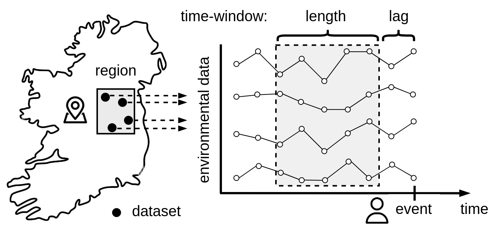

# serdif-ui

The serdif-ui is the user interface component of the 
Semantic Environmental and Rare disease Data Integration Framework (SERDIF). The goal of this user interface 
is to facilitate the linkage process for Health Data Researchers (HDR) when trying to link environmental data
with individual events through location and time, irrespective of the event data set. For example, when trying
to study the environmental risk factors associated to health events, such as hospital admissions or disease relapses).

The serdif-ui is available at [https://serdif-converter.adaptcentre.ie/](https://serdif-converter.adaptcentre.ie/)

## Key Concepts
**Event**: something that occurs in a certain place during a particular time.

**Data linkage**: result of a semantic query that integrates environmental data **within the region of the event** and 
selects a **period of data before the event**.

  

## How does it work?

### Step 1: Upload Event Dataset to Link

The event data set only requires location and time for each event as the following example dataset:

| event | country |   region    |       evDateT        | wLen | wLag |
|:-----:|:-------:|:-----------:|:--------------------:|:----:|:----:|
|   A   |   IE    |    IE04     | 2018-02-05T00:00:00Z |  14  |  0   |
|   B   |   IE    |    IE061    | 2019-08-20T00:00:00Z |  14  |  7   |
|   C   |   IE    |    IE05     | 2020-11-01T00:00:00Z |  5   |  10  |
|   D   |   IE    | IE061 IE062 | 2021-04-30T00:00:00Z |  10  |  0   |

* **event**: event ID or name (unique string)
* **country**: standard two letter abbreviation for the country where the event happened (string)
* **region**: Nomenclature of territorial units for statistics ([NUTS](https://ec.europa.eu/eurostat/web/regions-and-cities/overview)) (space separated string)
* **evDateT**: date of the event in a date time format (YYYY-MM-DDThh:mm:ssTZD)
* **wLen**: length of the time window in days (integer)
* **wLag**: lag from the evDateT in days (integer)

Further information on the regions as [summary pdf](https://ec.europa.eu/eurostat/documents/3859598/9397402/KS-GQ-18-007-EN-N.pdf), [clickable flags](https://ec.europa.eu/eurostat/web/nuts/nuts-maps) or [interactive map](https://ec.europa.eu/statistical-atlas/viewer/)

The event dataset can be imported externally (following the format above) or editing the data table example proposed.

### Step 2: Select Data Linkage Options

**Linkage Purpose**: the purpose refers to what the user wants to do with the linked data as it will affect 
the (meta)data content retrieved.

**Metadata Input**: the fields of information required to run the query within a given context.

**Temporal Unit**: time unit resolution of the resulting linked data

**Aggregation Method**: aggregation method to integrate the environmental datasets within the selected region

**Data File Format**: the resulting event-environmental data can be exported as a data table and/or graph.

Once the linkage options have been selecte
The runs queries to the [https://serdif-example.adaptcentre.ie/](https://serdif-example.adaptcentre.ie/) endpoint 
hosted in a [Ontotext GraphDB Free](https://graphdb.ontotext.com/) triplestore within
the [ADAPT centre](https://www.adaptcentre.ie/) at [Trinity College Dublin](https://www.tcd.ie/).

### Step 3: Export the Output
The resulting event-environmental linked data is compressed in a zip file that contains:

1. The data for analysis as a data table and/or graph
2. The metadata for research or publication
3. The interactive report to explore the (meta)data 

## Environmental Data Available

|         country          |                                    weather                                    |                                           air_pollution                                            | regions                                                               | data_period |     version     |
|:------------------------:|:-----------------------------------------------------------------------------:|:--------------------------------------------------------------------------------------------------:|-----------------------------------------------------------------------|:-----------:|:---------------:|
| Republic of Ireland (IE) | [MetÉireann (met)](https://www.met.ie/climate/available-data/historical-data) | [European Environmental Agency (eea)](https://discomap.eea.europa.eu/map/fme/AirQualityExport.htm) | [NUTS](https://ec.europa.eu/eurostat/web/regions-and-cities/overview) |  2000-2021  | 20211012T120000 |
|        Japan (JP)        |                                       -                                       |                                                 -                                                  |                                                                       |      -      |        -        |
|   United Kingdom (UK)    |                                       -                                       |                                                 -                                                  |                                                                       |      -      |        -        |
|          (...)           |                                       -                                       |                                                 -                                                  |                                                                       |      -      |        -        |

## Environmental data sources for version 20211012T120000 in IE

Albert Navarro-Gallinad. (2021). Weather and Air Quality data for Ireland as RDF data cube (20211012T120000) [Data set]. Zenodo. https://doi.org/10.5281/zenodo.5668287

## Data Provenance
* Weather: [MetÉireann (met)](https://www.met.ie/climate/available-data/historical-data)
* Air pollution: [European Environmental Agency (eea)](https://discomap.eea.europa.eu/map/fme/AirQualityExport.htm)
* Data Period: 2000-2021
* Country: Republic of Ireland (IE)
* Version: 20211012T120000

## Data Lineage
* The activity describes a [SPARQL query](https://www.w3.org/TR/sparql11-query/) to associate environmental data 
to particular health events by reasoning over location and time. 
* The [GeoSPARQL](https://graphdb.ontotext.com/documentation/standard/geosparql-support.html) function geof:sfWithin is used to select environmental data within the region 
of each event, and xsd:duration to filter a specific time window prior to the event. 
* Example fields:
  * region WEXFORD
  * time window with a duration of 4 DAYS lagged 5 DAYS from the event 

## Data input

Environmental data will be queried within a region and from a time window (period) 
prior to individual events as in the diagram before

  

In order to match environmental data with individual events region and dates need to be real.

Therefore, we need to define the following parameters for each event 
with the same column headers that are case-sensitive:

### Example CSV input

## How to use serdif-api
The following instructions are Linux and Windows based using the respective distributions, which 
contain the necessary build to run the serdif-api. Therefore, having installed Python on your
computer with the required packages is not required.

However, if you are a Mac OS user please refer to the *[Building](#Building)* Section a the end of this document

### Setup

#### 1. Download serdif-api github repo

[Download zip](https://github.com/navarral/serdif-api/archive/refs/heads/main.zip)
   or Clone the repo with `git clone https://github.com/navarral/serdif-api.git`

#### 2. Extract the content of the zip file (unzip)

#### 3. Go to the `dist` folder and open a terminal in the `dist` folder

* Linux: right click and select 'Open in Terminal'
* Windows: type 'cmd' in the folder address bar

#### 4. Check required parameters for the serdif-api
Type in the terminal window:

* Linux: `./apidata_fromcsv -h`
* Windows: `apidata_fromcsv.exe -h`

### Querying

#### 7. Pass the following parameters to `apidata_fromcsv`:

* **dataPath**: path to the event data csv file
* **metadataPath**: path to the metadata info csv file (can be 'none')
* **timeUnit**: temporal units for retrieved environmental data set from: hour, day, month or year
* **spAgg**: spatio-temporal aggregation method for the environmental data sets from: AVG, SUM, MIN or MAX
* **dataFormat**: returning data format as CSV or RDF
* **username**: username credentials for https://serdif-example.adaptcentre.ie/
* **password**: password credentials for https://serdif-example.adaptcentre.ie/

#### 8. Example in-line commands: 

* Main interest is to retrieve data as a CSV for analysis (`metadataPath: none, dataFormat: CSV`)
  * Linux: `./apidata_fromcsv event_data.csv none day AVG CSV username password`
  * Windows: `apidata_fromcsv.exe event_data.csv none day AVG CSV username password`

* Retrieving open-ready data for publication (`metadataPath: event_metadata.csv, dataFormat: RDF`) requires 
  an event metadata file such as [event_metadata.csv](https://github.com/navarral/serdif-api/blob/main/event_metadata.csv).
  * Linux: `./apidata_fromcsv event_data.csv event_metadata.csv day AVG RDF username password`
  * Windows: `apidata_fromcsv.exe event_data.csv event_metadata.csv day AVG RDF username password`

* Open-ready data will be retrieved as a zip file ([example](https://github.com/navarral/serdif-api/blob/main/ee-openready-20211012T120000-QT-20211209T184108.zip)) that contains:
  * (i) data as csv: environmental data associated to particular events as a datatable
  * (ii) data as rdf: environmental data associated to particular events as a graph 
  * (iii) metadata for publication as rdf: metadata record with generalized information about the data
  that do not contain personal data as a graph; therefore, publishable.
  * (iv) metadata for open-ready as rdf: metadata records with detailed information about the data,
  such as individual dates, regions, data sets used and data lineage; which could lead to data privacy issues
  if published without approval from the Data Protection Officer (DPO) and data controller.

### Building
Python version 3.6 or newer is required to be installed in your system to continue with the steps below.

* Install venv or virtual environment in Python

`python3 -m pip install --user virtualenv`

* Activate the virtual environment from the `venv` folder available in the repo

`source venv/bin/activate`

* Install the Python packages from the `requirements.txt` file

`pip install -r requirements.txt`

* Run the `app.py`

`python3 app.py`

|   Data Type   |                               Source                               |  Period   |                              Country                              |
|:-------------:|:------------------------------------------------------------------:|:---------:|:-----------------------------------------------------------------:|
|    Climate    |        [Copernicus](https://doi.org/10.24381/cds.e2161bac)         | 2000-2021 | Ireland :IE:\nUnited Kingdom :GB:\nCzechia :CZ:\nSwitzerland :CH: |
| Air Pollution | [EEA](https://www.eea.europa.eu/data-and-maps/data/aqereporting-9) | 2000-2021 |                                 s                                 |